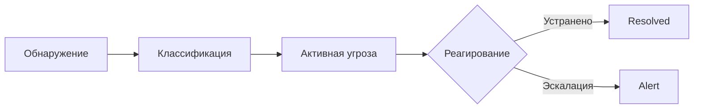

# 🛡️ Corporate Threat Detection

<div align="center">

**Интеллектуальная система обнаружения и предотвращения корпоративных киберугроз**

[](https://flutter.dev)
[](https://dart.dev)
[](https://firebase.google.com)
[](LICENSE)

[📱 Скачать](#-установка) • [📖 Документация](#-функциональность) • [🤝 Вклад](#-вклад-в-проект)

</div>

---

## 📋 Оглавление

- [Обзор](#-обзор)
- [Ключевые возможности](#-ключевые-возможности)
- [Функциональность](#-функциональность)
- [Архитектура](#-архитектура)
- [Установка](#-установка)
- [API Интеграция](#-api-интеграция)
- [Безопасность](#-безопасность)
- [Технологии](#-технологии)

---

## 🎯 Обзор

**Corporate Threat Detection** — это передовое мобильное решение для специалистов по информационной безопасности (SOC-аналитиков, CISO, DevSecOps), обеспечивающее:

> 🔍 **Мониторинг 24/7** — Непрерывное отслеживание всех устройств и трафика в корпоративной сети
>
> ⚡ **Мгновенное реагирование** — Push-уведомления об угрозах в режиме реального времени
>
> 📊 **Глубокая аналитика** — Визуализация данных и генерация отчётов
>
> 🤖 **AI-анализ** — Машинное обучение для обнаружения аномалий

### Для кого это приложение?

| Роль | Применение |
|------|------------|
| 🔐 **SOC-аналитик** | Мониторинг угроз, анализ инцидентов |
| 👔 **CISO** | Стратегические отчёты, управление рисками |
| 🛠️ **Сетевой администратор** | Контроль устройств, анализ трафика |
| 🏢 **IT-директор** | Обзор состояния безопасности |

---

## ✨ Ключевые возможности

<table>
<tr>
<td width="50%">

### 🎯 Обнаружение угроз
- Сигнатурный анализ
- Поведенческий анализ  
- Обнаружение аномалий
- Rule-based детекция

</td>
<td width="50%">

### 🌐 Мониторинг сети
- Инвентаризация устройств
- Анализ протоколов
- Журналирование трафика
- API мониторинг

</td>
</tr>
<tr>
<td width="50%">

### 📊 Аналитика
- Дашборды в реальном времени
- Статистика по угрозам
- Графики и диаграммы
- Экспорт отчётов

</td>
<td width="50%">

### ⚙️ Управление
- Гибкие правила безопасности
- Управление пользователями
- Настройка уведомлений
- Мультиязычность (RU/EN/UZ)

</td>
</tr>
</table>

---

## 🚀 Функциональность

### 🔐 Модуль аутентификации
```
/login          → Вход в систему
/register       → Регистрация
/forgot-password → Восстановление пароля
```

**Особенности:**
- JWT-аутентификация с refresh токенами
- Автоматическое восстановление сессии
- Безопасное хранение credentials

---

### 📊 Панель управления (Dashboard)

| Маршрут | Экран | Функционал |
|---------|-------|------------|
| `/dashboard` | **Overview** | Ключевые метрики, общее состояние системы, виджеты статистики |
| `/dashboard/realtime` | **Realtime** | Live-мониторинг угроз, потоковые данные, события в реальном времени |
| `/dashboard/threat-summary` | **Summary** | Сводка угроз за период, тренды, прогнозы |

---

### ⚠️ Управление угрозами



| Маршрут | Описание |
|---------|----------|
| `/threats` | Активные угрозы с приоритетами (Critical/High/Medium/Low) |
| `/threats/resolved` | Архив устранённых угроз с timeline |
| `/threats/detail` | Детальный анализ: IOC, MITRE ATT&CK mapping, рекомендации |
| `/threats/types` | Каталог типов угроз: malware, phishing, DDoS, insider threats |

---

### 🌐 Сетевой мониторинг

| Экран | Функциональность |
|-------|------------------|
| **Network Devices** | Полный список устройств: IP, MAC, hostname, статус, last seen |
| **Device Detail** | Профиль устройства: история подключений, репутация, связи |
| **API Usage** | Мониторинг API-вызовов устройства: endpoints, частота, аномалии |
| **Protocols** | Анализ протоколов: HTTP/HTTPS, DNS, SSH, нестандартные порты |
| **Traffic Logs** | Журнал трафика: source/dest, объём, временные метки |

---

### 🔍 Методы обнаружения

| Метод | Применение | Эффективность |
|-------|------------|---------------|
| **Anomaly Detection** | Отклонения от baseline поведения | 🟢 Новые угрозы |
| **Behavior Analysis** | Паттерны действий пользователей | 🟢 Insider threats |
| **Rule-based** |预定义 правила (SIEM) | 🟡 Известные угрозы |
| **Signature-based** | Хэши и сигнатуры malware | 🟡 Известное ПО |

---

### 📝 Журналы и история

- **Logs** — Системные события с фильтрацией по severity, source, времени
- **History** — Полный audit trail всех действий пользователей

---

### ⚙️ Настройки

| Раздел | Возможности |
|--------|-------------|
| **Alerts** | Push/Email уведомления, пороги срабатывания, расписание |
| **Rules** | CRUD правил безопасности, приоритеты, условия |
| **User Management** | Пользователи, роли (Admin/Analyst/Viewer), права доступа |

---

## 🏗️ Архитектура

### Clean Architecture + Feature-based структура

```
lib/
├── 📁 core/                      # Ядро приложения
│   ├── connectivity/             # Проверка интернет-соединения
│   ├── database/                 # Hive локальное хранилище
│   ├── themes/                   # Light/Dark темы
│   ├── helper/                   # Вспомогательные функции
│   └── utils/                    # Утилиты, расширения
│
├── 📁 features/                  # Функциональные модули
│   ├── auth/                     
│   ├── dashboard/                
│   ├── analytics/                
│   ├── threats/                  
│   ├── network/                  
│   ├── methods/                  
│   ├── logs/                     
│   └── settings/                 
│
├── 📁 router/                    # GoRouter навигация
│   ├── routes.dart               # Главный файл роутера
│   ├── app_routes.dart           # Конфигурация маршрутов
│   └── name_routes.dart          # Константы путей
│
├── 📁 service/                   # Сервисы
│   ├── notification_service.dart # FCM Push уведомления
│   └── remote_config_service.dart# Firebase Remote Config
│
├── 📁 constants/                 # Константы
├── 📁 generated/                 # Автогенерация (l10n)
│
├── app.dart                      # MaterialApp
├── main.dart                     # Entry point
└── injector_container.dart       # GetIt DI
```

### Структура Feature-модуля

```
feature/
├── 📁 data/
│   ├── datasources/          # Remote/Local data sources
│   ├── models/               # DTO модели (JSON serialization)
│   └── repositories/         # Реализация репозиториев
│
├── 📁 domain/
│   ├── entities/             # Бизнес-сущности (чистые Dart классы)
│   ├── repositories/         # Абстрактные репозитории
│   └── usecases/             # Бизнес-логика (Single Responsibility)
│
└── 📁 presentation/
    ├── bloc/                 # BLoC/Cubit состояния
    ├── pages/                # Страницы (StatefulWidget + Mixin)
    └── widgets/              # Переиспользуемые виджеты
```

---

## 📦 Установка

### Системные требования

| Платформа | Минимальная версия |
|-----------|-------------------|
| 🤖 Android | API 21 (5.0) |
| 🍎 iOS | 15.0+ |
| 🦋 Flutter | 3.27+ |
| 🎯 Dart | 3.6+ |

### Быстрый старт

```bash
# Клонирование
git clone https://github.com/SharifSharipov/corporate_threat_detection.git
cd corporate_threat_detection

# Зависимости
flutter pub get

# Генерация кода (если нужно)
flutter pub run build_runner build --delete-conflicting-outputs

# Запуск
flutter run
```

### Сборка релиза

```bash
# Android APK (все архитектуры)
flutter build apk --release

# Android APK (раздельно по архитектурам)  
flutter build apk --split-per-abi

# Android App Bundle (для Google Play)
flutter build appbundle --release

# iOS
flutter build ios --release
cd ios && pod install && cd ..
```

---

## � API Интеграция

Приложение интегрируется с backend через REST API:

```dart
// Базовый URL настраивается в constants
baseUrl: Constants.baseUrl

// Интерсепторы:
- AuthTokenInterceptor   // JWT токены
- RetryInterceptor       // Повторные попытки
- ChuckInterceptor       // Debug HTTP inspector
```

### Обработка ошибок

- Автоматический refresh токенов при 401
- Redirect на login при 403
- Retry логика для сетевых ошибок

---

## 🔒 Безопасность

| Механизм | Реализация |
|----------|------------|
| **Токены** | JWT с refresh, Hive encrypted storage |
| **SSL Pinning** | Проверка сертификатов (настраиваемо) |
| **Obfuscation** | ProGuard для релизных сборок |
| **Secure Storage** | flutter_secure_storage для credentials |

---

## 🛠️ Технологии

### Core
| Технология | Версия | Назначение |
|------------|--------|------------|
| Flutter | 3.27 | UI Framework |
| Dart | 3.6 | Язык программирования |
| go_router | latest | Декларативная навигация |
| flutter_bloc | latest | State Management |
| get_it | latest | Dependency Injection |

### Сеть и данные
| Технология | Назначение |
|------------|------------|
| dio | HTTP клиент с интерсепторами |
| hive | Быстрое локальное NoSQL хранилище |
| chuck_interceptor | HTTP инспектор в debug режиме |

### Firebase
| Сервис | Назначение |
|--------|------------|
| Cloud Messaging | Push-уведомления |
| Remote Config | Динамическая конфигурация |

### Локализация
| Технология | Языки |
|------------|-------|
| flutter_localizations | 🇷🇺 RU, 🇺🇸 EN, 🇺🇿 UZ |
| intl | Форматирование дат, чисел |

---

## 📱 Скриншоты

<div align="center">
<i>Скриншоты будут добавлены в ближайшее время</i>
</div>

---

## 👥 Команда

<table>
<tr>
<td align="center">
<a href="https://github.com/SharifSharipov">
<br />
<sub><b>Sharif Sharipov</b></sub>
</a><br />
<sub>Lead Developer</sub>
</td>
</tr>
</table>

---

## 🤝 Вклад в проект

Мы приветствуем вклад в развитие проекта!

1. 🍴 Fork репозитория
2. 🌿 Создайте feature branch: `git checkout -b feature/amazing-feature`
3. 💾 Commit: `git commit -m 'Add amazing feature'`
4. 📤 Push: `git push origin feature/amazing-feature`
5. 🔃 Откройте Pull Request

### Стиль кода

```bash
# Анализ кода
flutter analyze

# Форматирование
dart format lib/

# Автоисправление
dart fix --apply
```

---

## 📄 Лицензия

```
MIT License

Copyright (c) 2026 Sharif Sharipov

Permission is hereby granted, free of charge, to any person obtaining a copy
of this software and associated documentation files (the "Software"), to deal
in the Software without restriction...
```

---


</div>
